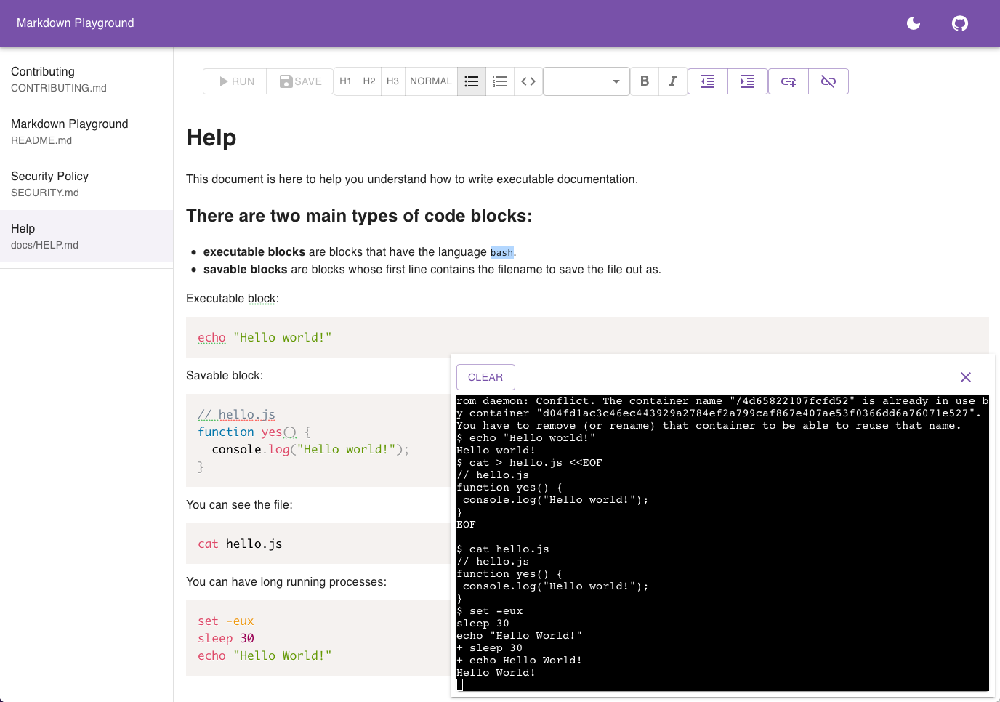

# Markdown Playground

Markdown is a common format used for docs, I want a "runnable markdown" website:

- Code examples should be runnable by just clicking on a button.
- The output of the code should appear on screen, next to the code.
- The execution could be sandboxed using Docker.
- Environment variables should persist between executions.
- A “run” might exit, or it might not. You should be able to SIGTERM any console.

I also want a better editing experience:

- Each playground is just a directory of files.
- Edit using WYSIWYG.
- Edits are live updated to the source code, and vice-versa.
- I can run when I edit.

I want to publish a site:

- Statically either:
  - As a plain set of markdown files.
  - Any tool I already have.
  - A built-in publisher that makes it look like the WYSIWYG editor.
- Dynamically:
  - The site is runnable (using sandboxed executors and Oauth login).



# Usage

Download the [latest release](https://github.com/markdownplayground/markdownplayground/releases/latest), then in a
directory containing your docs:

```bash
docker pull ubuntu ;# make sure you have the image
markdownplayground
```

Open [http://localhost:8080](http://localhost:8080).

If you want to use the Kubernetes executor:

```bash
kubectl create serviceaccount markdownplayground
```

```bash
kubectl create -f - <<EOF
apiVersion: scheduling.k8s.io/v1
kind: PriorityClass
metadata:
  name: markdownplayground
value: -1
EOF
```

```bash
markdownplayground -r k8s
```

If you want to use the local executor:

```bash
markdownplayground -r local
```

If you want a different directory:

```bash
markdownplayground ../other-dir
```

Enable edit mode:

```bash
markdownplayground -e
```

# Comparables

- [MarkDoc](https://markdoc.dev/) general docs (Stripe)
- [Readme](https://readme.com/) API docs
- [Read the Docs](https://readthedocs.org/) generic docs
- [Gitbook](https://www.gitbook.com/) markdown as book
- [MkDocs](https://github.com/mkdocs/mkdocs/) very popular static tool
- [Outline](http://www.getoutline.com/) commercial docs
